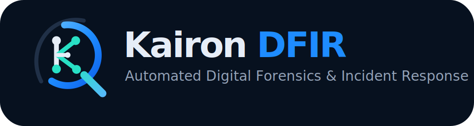
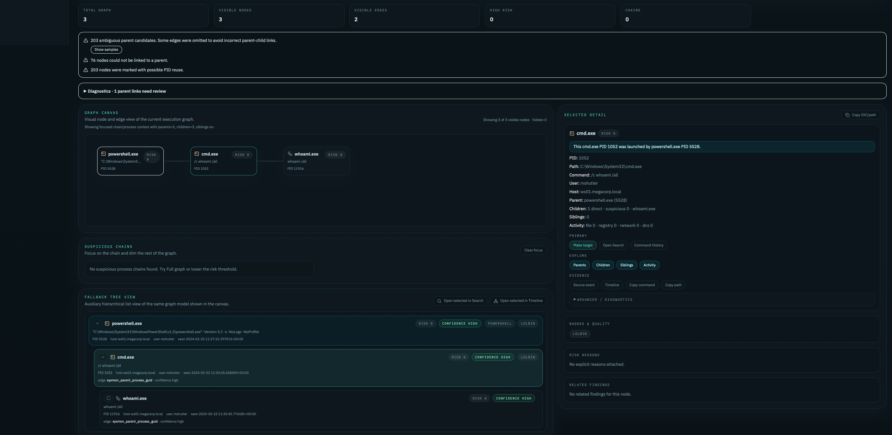

<p align="center">
  
</p>

<h1 align="center">Kairon DFIR</h1>

<p align="center">
  <strong>Local-first DFIR investigation platform for centralizing artifacts, reducing noise, and reconstructing incidents.</strong>
</p>

<p align="center">
  
</p>

<p align="center">
  
  
  
  
</p>


Kairon DFIR supports the analyst; it does not replace them. It provides a clear lens over forensic evidence so critical moments can be interpreted faster and with more context.

The project is intended for trusted labs and controlled private beta deployments. Evidence can contain highly sensitive data. Do not expose Kairon DFIR directly to the internet without authentication, VPN, or a protected reverse proxy.

## What It Does

- Ingests Windows forensic evidence into case-centered investigations.
- Normalizes artifacts for search, triage, timelines, detections, findings, and reports.
- Provides analyst workflows for Search, Artifact Views, Command History, Execution Stories, Incident Timeline, Findings, and Reports.
- Keeps demo and validation features optional and disabled by default for normal investigations.

## Quick Start

Requirements:

- Docker and Docker Compose plugin.
- 4 CPU cores minimum; 8+ preferred for multi-host evidence.
- 16 GB RAM minimum; 32 GB preferred for full MFT and large OpenSearch indices.
- Persistent disk sized for uploaded evidence plus extracted/indexed data.

```bash
git clone https://github.com/yokddj/kairon-dfir.git
cd kairon-dfir
cp .env.example .env
docker compose up -d --build
```

Open:

- Frontend: http://127.0.0.1:5173
- Backend health: http://127.0.0.1:8000/health
- API docs: http://127.0.0.1:8000/docs

Default beta/investigation mode is clean:

```bash
DFIR_ENABLE_DEMO_CASES=false
DFIR_ENABLE_VALIDATION_FEATURES=false
DFIR_DEFAULT_CASE_MODE=investigation
```

Use demo/validation flags only in training, QA, or controlled product demonstrations. This repository does not include evidence archives, processed data, OpenSearch indexes, Postgres dumps, public challenge datasets, or answer keys.

## First Investigation Workflow

1. Create a case
   - Open Kairon DFIR.
   - Go to Cases.
   - Click Create case.
   - Give it a name and timezone.

2. Add evidence
   - Open the case.
   - Go to Evidence & Ingest.
   - Upload a supported evidence archive or collection.
   - Wait for raw discovery.

3. Index evidence for investigation
   - Click Index evidence for investigation.
   - Use recommended indexing for the normal path.
   - Use Index selected artifact types only when you want a focused parse.

4. Start triage
   - Use Investigation Home.
   - Review Search.
   - Review Command History.
   - Review Artifact Views.
   - Check Startup & Persistence, MOTW/Downloaded Files, and Email Artifacts if present.

5. Build findings
   - Promote relevant evidence into Findings.
   - Use correlation carefully with visible scope.
   - Add important events to Incident Timeline.

6. Generate a report
   - Use Reports after evidence and findings exist.
   - Export Markdown for review.

Kairon DFIR assists the analyst; final interpretation remains the analyst's responsibility.

## Demo DFIR Lab

Kairon DFIR includes a small Windows DFIR demo case designed to help analysts test ingest, search, timeline reconstruction and artifact pivoting using a controlled Velociraptor collection.

Start here: [Demo documentation](docs/demo/README.md) or open [Kairon Lab 01 - Suspicious PowerShell Activity](docs/demo/kairon-lab01/README.md).

Do not commit private evidence archives, processed case data, customer datasets or generated case data. Keep local demo archives under `demo/evidence/`; they are ignored by git.

## Supported Evidence And Artifact Overview

Coverage depends on the artifacts present in the uploaded evidence and on parser availability in the deployment.

| Area | Examples |
| --- | --- |
| Event logs | EVTX, Sysmon, Security, PowerShell |
| Filesystem | MFT, MOTW/Zone.Identifier |
| Execution | Prefetch, Shimcache, Amcache, LNK, Jump Lists |
| User activity | RecentDocs, UserAssist, OpenSaveMRU |
| Persistence | Scheduled Tasks, Services, registry autoruns, startup folders |
| Browser/email triage | Browser history/downloads, mail stores, webmail traces |
| Investigation outputs | Findings, Incident Timeline, Reports |

## Security Warning

Do not expose ports `5173`, `8000`, `5601`, `9200`, `5432`, or `6379` directly to the internet. Place the deployment behind VPN, SSO/authentication, firewall rules, or a properly configured reverse proxy.

Treat these as sensitive:

- uploaded evidence;
- extracted parser outputs;
- OpenSearch indexes;
- Postgres data;
- generated reports;
- debug exports;
- backups;
- `.env` files.

Never commit real evidence, secrets, logs, backups, database dumps, or generated reports.

## Documentation

- [Documentation index](docs/index.md)
- [User guide](docs/user_guide.md)
- [Feature map](docs/feature_map.md)
- [Artifact support matrix](docs/artifacts_matrix.md)
- [Demo labs](docs/demo/README.md)
- [Private beta deployment](docs/deployment/beta-deployment.md)
- [Investigation vs demo/validation modes](docs/deployment/beta-vs-demo-mode.md)
- [Security notes](docs/SECURITY.md)
- [Known limitations](docs/KNOWN_LIMITATIONS.md)
- [Validation workflow](docs/validation/README.md)

## Known Limitations

- This beta is not a hosted SaaS security boundary.
- OST/PST content parsing is not part of the current core parser set.
- SRUM parsing requires a Windows-capable worker or backend alternative.
- Some advanced Windows artifacts may require additional parser workers or tooling.
- Validation Matrix is optional QA/demo metadata; it is not part of normal investigations.
- Kairon DFIR assists analysis, but final interpretation remains the analyst's responsibility.

## License

See [LICENSE](LICENSE).
