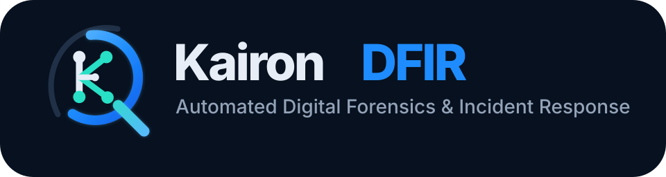
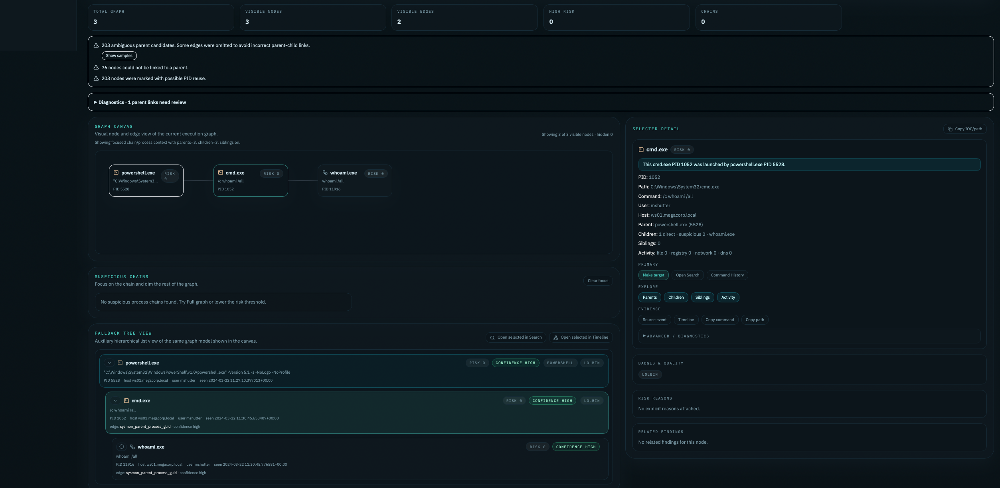

<p align="center">
  
</p>

<h1 align="center">Kairon DFIR</h1>

<p align="center">
  <strong>Local-first DFIR investigation platform for centralizing artifacts, reducing noise, and reconstructing incidents.</strong>
</p>

<p align="center">
  
</p>

<p align="center">
  
  
  
  
</p>


Kairon DFIR supports the analyst; it does not replace them. It provides a clear lens over forensic evidence so critical moments can be interpreted faster and with more context.

The project is intended for trusted labs and controlled private beta deployments. Evidence can contain highly sensitive data. Do not expose Kairon DFIR directly to the internet without authentication, VPN, or a protected reverse proxy.

## What It Does

- Ingests Windows and Linux forensic evidence into case-centered investigations.
- Organizes investigations with case status, priority, tags, notes, archive/close lifecycle actions, and filters. See [docs/case-management.md](docs/case-management.md).
- Normalizes a growing set of Windows, Linux, and memory artifacts for search, triage, timelines, detections, findings, and reports. See [docs/parser-coverage.md](docs/parser-coverage.md) for exact parser support status.
- Provides analyst workflows for Search, Artifact Views, Command History, Execution Stories, Incident Timeline, Findings, and Reports.
- Records evidence SHA-256, size, upload metadata, integrity checks, custody events, and exportable JSON manifests. See [docs/evidence-integrity.md](docs/evidence-integrity.md).
- Shows a per-case Evidence Processing Queue with parser status, errors, partial results, and navigation to evidence, artifacts, Search, and memory views. See [docs/processing-queue.md](docs/processing-queue.md).
- Includes an experimental Memory Analysis workflow for authorized RAM evidence, disabled by default and isolated from current global Search, Timeline, Detections, Findings, Reports, and SIEM.
- Keeps validation features optional and disabled by default for normal investigations.

## Quick Start

Requirements:

- **Linux** (Ubuntu/Debian recommended) with Docker and Docker Compose v2.
- **macOS** with Docker Desktop (best-effort in this beta).
- **Windows** via WSL2 (Ubuntu). See [docs/windows-wsl.md](docs/windows-wsl.md). Native PowerShell is not supported.

Hardware:
- 4 CPU cores minimum; 8+ preferred for multi-host evidence.
- 16 GB RAM minimum; 32 GB preferred for full MFT and large OpenSearch indices.
- Persistent disk sized for uploaded evidence plus extracted/indexed data.

```bash
git clone https://github.com/yokddj/kairon-dfir.git
cd kairon-dfir
./scripts/setup.sh
```

The setup wizard generates configuration, builds Docker images, and starts all services. Open the URL shown at the end — the first-run wizard creates your admin account in the browser.

### Manual Commands (Alternative)

```bash
./scripts/setup.sh --no-start        # configure + build only
docker compose up -d                  # start manually
```

### Deployment Modes

| Scenario | Mode | Example URL |
|----------|------|-------------|
| Browser and Kairon on the same machine | `localhost` | `http://localhost:5173` |
| Access from other machines on a trusted LAN | `lan` | `http://192.0.2.10:5173` |
| Domain, TLS or untrusted networks | `https` | `https://kairon.example.com` |

> **LAN mode uses HTTP and must not be exposed to untrusted networks.**

See [docs/deployment-modes.md](docs/deployment-modes.md) for details.

For memory analysis support:

```bash
docker compose --profile memory build --pull
docker compose --profile memory up -d
```

### First-Run Experience

On first launch with zero users:
1. Browser opens http://localhost:5173
2. Setup wizard appears (create admin account)
3. After creation, you're automatically logged in
4. Admin can add more users from Admin → Users

Normal operation:
1. Login page appears
2. Enter credentials
3. Dashboard loads

See [docs/first-run.md](docs/first-run.md) for details and troubleshooting.

### Troubleshooting Fresh Install

If the login page appears instead of the setup wizard, a stale Docker image is likely running:

```bash
# Verify zero users
docker compose exec postgres psql -U dfir -d dfir -c "SELECT COUNT(*) FROM users;"
# Must return: 0

# Verify endpoint
curl -s http://localhost:5173/api/auth/needs-setup
# Must return: {"needs_setup":true}

# Rebuild and restart
docker compose build --no-cache --pull backend frontend
docker compose up -d backend frontend
```

Other diagnostic commands:
```bash
git rev-parse HEAD                 # commit in use
docker compose images               # image IDs and creation time
docker compose logs --tail=50 backend frontend
docker compose ps
```

See [docs/first-run.md](docs/first-run.md) and [docs/troubleshooting.md](docs/troubleshooting.md) for more.

### Roles

Kairon uses two roles: **Administrator** and **Standard user**. Both can use all investigation features. Only administrators can view and manage other users.

See [docs/roles-and-permissions.md](docs/roles-and-permissions.md).

> Per-case user assignment is not enabled in the current beta.

### After First Login

1. Go to **Admin → Users**.
2. Click **Create user**.
3. Choose **Standard user** as the default role.
4. Test the new account and verify it cannot access Admin → Users.

### Upgrading

```bash
./scripts/setup.sh --upgrade     # pull code, rebuild, restart — preserves all data
```

Or manually:
```bash
git pull
docker compose build --pull
docker compose up -d --force-recreate
```

> `git pull` alone does not update running containers. A rebuild is required.
> Do not use `docker compose down -v` during upgrades — the `-v` flag permanently deletes all data.

## First Investigation Workflow

1. Create a case
   - Open Kairon DFIR.
   - Go to Cases.
   - Click Create case.
   - Give it a name and timezone.

2. Add evidence
   - Open the case.
   - Go to Evidence & Ingest.
   - Upload a supported evidence archive or collection.
   - Wait for raw discovery.

3. Index evidence for investigation
   - Click Index evidence for investigation.

4. Capture findings and notes
   - Open the case Findings tab.
   - Create draft notes or confirmed findings with severity, status, tags, and evidence/host links.
   - Use Add finding from Evidence Detail or Memory to prefill context.
   - Use recommended indexing for the normal path.
   - Use Index selected artifact types only when you want a focused parse.

4. Start triage
   - Use Investigation Home.
   - Review Search.
   - Review Command History.
   - Review Artifact Views.
   - Check Startup & Persistence, MOTW/Downloaded Files, and Email Artifacts if present.

5. Build findings
   - Promote relevant evidence into Findings.
   - Use correlation carefully with visible scope.
   - Add important events to Incident Timeline.

6. Generate a report
   - Use Reports after evidence and findings exist.
   - Export Markdown for review.

Kairon DFIR assists the analyst; final interpretation remains the analyst's responsibility.

## Supported Evidence And Artifact Overview

Coverage depends on the artifacts present in the uploaded evidence and on parser availability in the deployment.

| Area | Examples |
| --- | --- |
| Event logs | EVTX, Sysmon, Security, PowerShell |
| Filesystem | MFT, MOTW/Zone.Identifier |
| Execution | Prefetch, Shimcache, Amcache, LNK, Jump Lists |
| User activity | RecentDocs, UserAssist, OpenSaveMRU |
| Persistence | Scheduled Tasks, Services, registry autoruns, startup folders |
| Browser/email triage | Browser history/downloads, mail stores, webmail traces |
| Linux artifacts | Authentication logs, syslog, audit logs, shell history, cron, systemd, SSH, identity, sudoers, packages, network config, OS info (partial) |
| Memory analysis | Planned/experimental authorized RAM evidence upload and isolated Volatility metadata/process profiles, disabled by default |
| Investigation outputs | Findings, Incident Timeline, Reports |

## Security Warning

Do not expose ports `5173`, `8000`, `5601`, `9200`, `5432`, or `6379` directly to the internet. Place the deployment behind VPN, SSO/authentication, firewall rules, or a properly configured reverse proxy.

Treat these as sensitive:

- uploaded evidence;
- extracted parser outputs;
- OpenSearch indexes;
- Postgres data;
- generated reports;
- debug exports;
- backups;
- `.env` files.

Never commit real evidence, secrets, logs, backups, database dumps, or generated reports.

Do not commit private evidence archives, processed case data, customer datasets, generated reports, indexes, database dumps or local environment files. Keep all evidence and generated case data outside version control.

Memory dumps can contain credentials, personal data, and third-party private data. Use only RAM evidence you own, are authorized to analyze, or lab/demo evidence created for that purpose. The recommended RAM workflow is Case -> Memory Analysis -> Add memory image. Do not commit memory dumps, extracted secrets, malware, symbol packs, or third-party memory-forensics outputs. External memory tools such as Volatility 3 and MemProcFS are not bundled. Optional Volatility 3 execution is disabled by default and requires administrator-controlled configuration plus an authorization acknowledgement per scan.

Memory backend readiness checks use only trusted server-side command settings such as `VOLATILITY3_COMMAND` and `MEMPROCFS_COMMAND`. They reject shell fragments and arguments, run harmless help/version checks only, and never receive memory-image paths.

Windows symbol resolution is offline-only by default. Managed acquisition
remains unavailable until the deployment enforces restricted official-source
egress and local-operator authorization. See
[Managed Windows symbols](docs/memory_symbols.md), the
[Symbol Egress Gateway](docs/symbol_egress_gateway.md) architecture, and the
[Local Operator Approval](docs/memory_symbol_operator_approval.md) workflow.

An optional, non-default `symbol-fetcher` service provides the isolated
client. An optional `symbol-egress-gateway` service provides the only
outbound HTTPS path. The fetcher is attached only to a Docker `internal: true`
network; the gateway is the only component connected to a network with a
default route. See [its security model](docs/symbol_fetcher_security.md).

## Documentation

- [Documentation index](docs/index.md)
- [User guide](docs/user_guide.md)
- [Feature map](docs/feature_map.md)
- [Artifact support matrix](docs/artifacts_matrix.md)
- [Memory Analysis](docs/memory_analysis.md)
- [Memory Upload](docs/memory_upload.md)
- [Memory Upload UX](docs/memory_upload_ux.md)
- [Managed Windows symbols](docs/memory_symbols.md)
- [Symbol Egress Gateway](docs/symbol_egress_gateway.md)
- [Local Operator Approval](docs/memory_symbol_operator_approval.md)
- [Private beta deployment](docs/deployment/beta-deployment.md)
- [Security notes](docs/SECURITY.md)
- [Known limitations](docs/KNOWN_LIMITATIONS.md)
- [Validation workflow](docs/validation/README.md)

## Known Limitations

- This beta is not a hosted SaaS security boundary.
- OST/PST content parsing is not part of the current core parser set.
- SRUM parsing requires a Windows-capable worker or backend alternative.
- Some advanced Windows artifacts may require additional parser workers or tooling.
- Memory Analysis is isolated and disabled by default. The dedicated Memory Analysis upload flow can register authorized `memory_dump` evidence when enabled, and the optional memory worker can run only the supported Volatility metadata/process profiles.
- Validation Matrix is optional QA metadata; it is not part of normal investigations.
- Kairon DFIR assists analysis, but final interpretation remains the analyst's responsibility.

## License

See [LICENSE](LICENSE).
