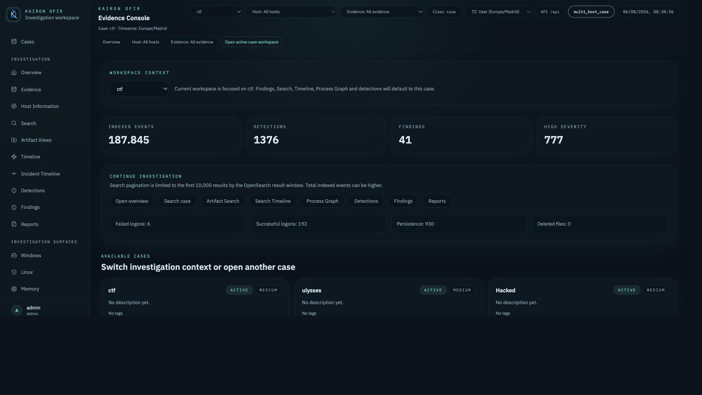
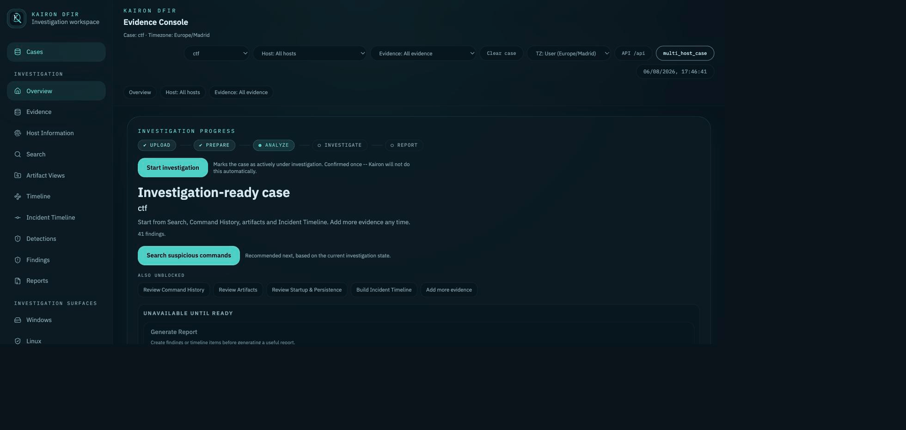

<p align="center">
  
</p>

<h1 align="center">Kairon DFIR</h1>

<p align="center">
  <strong>Local-first DFIR investigation platform for centralizing artifacts, reducing noise, and reconstructing incidents.</strong>
</p>

<p align="center">
  
</p>

<p align="center">
  
  
  
  
  
</p>

## What Kairon DFIR Is

Kairon DFIR is a self-hosted, case-centric digital forensics and incident response platform. It ingests Windows, Linux, disk-image, and memory evidence into a single investigation workspace, normalizes it into a common searchable model, and supports the analyst through Search, Timeline, Artifact Views, detections, findings, and reporting — without replacing analyst judgment.

Kairon DFIR is intended for trusted labs and controlled, self-hosted deployments, not as a hosted SaaS. Evidence can contain highly sensitive data; see [SECURITY.md](SECURITY.md) before exposing any deployment beyond your own machine.



## Key Capabilities

- Guided evidence intake (upload, disk image, folder, or existing path) with a preflight pipeline preview before anything runs. See [docs/evidence/unified-evidence-ingestion.md](docs/evidence/unified-evidence-ingestion.md).
- Read-only disk image ingestion: RAW, EWF, VMDK, VHD/VHDX, QCOW/QCOW2, VDI. See [docs/evidence/disk-image-ingestion.md](docs/evidence/disk-image-ingestion.md).
- A growing set of normalized Windows and Linux artifacts feeding Search, Timeline, Artifact Views, detections, findings, and reports. See [docs/artifacts/parser-coverage.md](docs/artifacts/parser-coverage.md) for exact status per family.
- Per-host Host Facts (Linux identity/OS attributes today) and a cross-platform Local Accounts inventory (Linux passwd/shadow/group; Windows SAM accounts corroborated by ProfileList). See [docs/evidence/host-information.md](docs/evidence/host-information.md).
- Case-scoped Search, Timeline, Command History, Execution Story, Incident Timeline, Findings, and Markdown Reports.
- Sigma and YARA detections, analyst-triggered rather than an always-on background scan. See [docs/rules/rules_sigma_yara.md](docs/rules/rules_sigma_yara.md).
- A Preview Memory Analysis capability for authorized RAM evidence, isolated from global Search/Timeline/Detections/Findings/Reports/SIEM; actual Volatility/MemProcFS analysis execution is opt-in per deployment. See [docs/memory/memory_analysis.md](docs/memory/memory_analysis.md).
- Evidence SHA-256, integrity checks, and custody events. See [docs/evidence/evidence-integrity.md](docs/evidence/evidence-integrity.md).

## Architecture

Kairon DFIR is organized around a **Core Platform** (case/evidence/host substrate, artifact and platform registries, generic ingestion pipeline, Search/Timeline, Findings/Reports) that every capability builds on without shaping it, plus **Core DFIR Capabilities** (Windows, Linux, Rules Engine) and **Preview capabilities** (Memory Analysis today) that depend on the Core Platform but never the other way around.

The stack itself is three planes: a React/TypeScript frontend, a FastAPI/Python backend with Redis-queued workers, and PostgreSQL + OpenSearch + filesystem storage for metadata, search, and evidence.

See [docs/roadmap.md](docs/roadmap.md) for capability maturity and [docs/architecture/overview.md](docs/architecture/overview.md) for the full architecture writeup.

## Installation

Requirements:

- **Linux** (Ubuntu/Debian recommended) with Docker and Docker Compose v2.
- **macOS** with Docker Desktop (best-effort).
- **Windows** via WSL2 (Ubuntu) — see [docs/getting-started/windows-wsl.md](docs/getting-started/windows-wsl.md). Native PowerShell is not supported.
- 4 CPU cores / 16 GB RAM minimum (8+ cores / 32 GB preferred for multi-host or large-MFT evidence).
- Persistent disk sized for uploaded evidence plus extracted/indexed data.

```bash
git clone https://github.com/yokddj/kairon-dfir.git
cd kairon-dfir
./scripts/setup.sh
```

The setup wizard generates configuration, builds Docker images, and starts all services. Configuration defaults are documented in `.env.example`; never commit a real `.env` file. See [docs/deployment/deployment.md](docs/deployment/deployment.md) for the full deployment reference (environment variables, volumes, health checks, upgrades) and [docs/deployment/deployment-modes.md](docs/deployment/deployment-modes.md) for `localhost` / `lan` / `https` modes.

## Quick Start

Open the URL the setup wizard prints at the end — the first-run wizard creates your admin account directly in the browser. See [docs/getting-started/first-run.md](docs/getting-started/first-run.md) for the full first-run flow and troubleshooting, and [docs/getting-started/roles-and-permissions.md](docs/getting-started/roles-and-permissions.md) for the two-role model (Administrator / Standard user).

## Investigation Workflow

1. **Create a case** — open Kairon DFIR, go to Cases, create a case with a name and timezone.
2. **Add evidence** — open the case, go to Evidence & Ingest, upload a supported evidence archive or collection.
3. **Index evidence for investigation** — use recommended indexing for the normal path, or index selected artifact types for a focused parse.
4. **Capture findings and notes** — create draft notes or confirmed findings from Evidence Detail, Search, Artifact Explorer, or Memory.
5. **Triage** — work through Investigation Home, Search, Command History, and Artifact Views.
6. **Build findings** — promote relevant evidence into Findings and add key events to the Incident Timeline.
7. **Generate a report** — export a Markdown report once evidence and findings exist.

Kairon DFIR assists the analyst; final interpretation remains the analyst's responsibility. See [docs/getting-started/user_guide.md](docs/getting-started/user_guide.md) for the full walkthrough.

## Documentation

Start at the [documentation index](docs/index.md) for the full, organized set of guides — getting started, architecture, evidence intake, per-artifact parser reference, Linux support, Memory Analysis, search and investigation, rules, deployment, and operations.

## License

Kairon DFIR is licensed under the GNU Affero General Public License v3.0 (AGPL-3.0) — see [LICENSE](LICENSE). Third-party tools and dependencies retain their own licenses and are not covered by this project's license grant; see [NOTICE](NOTICE) and [SECURITY.md](SECURITY.md#third-party-tools) for detail, in particular on Eric Zimmerman Tools, which are downloaded at Docker build time and not vendored in this repository.

## Contributing

Contributions are welcome. See [CONTRIBUTING.md](CONTRIBUTING.md) for how to build, test, and submit changes, and [CODE_OF_CONDUCT.md](CODE_OF_CONDUCT.md) for community expectations.

## Author and maintainer

Kairon DFIR was created and is maintained by Alejandro Gómez Román.
