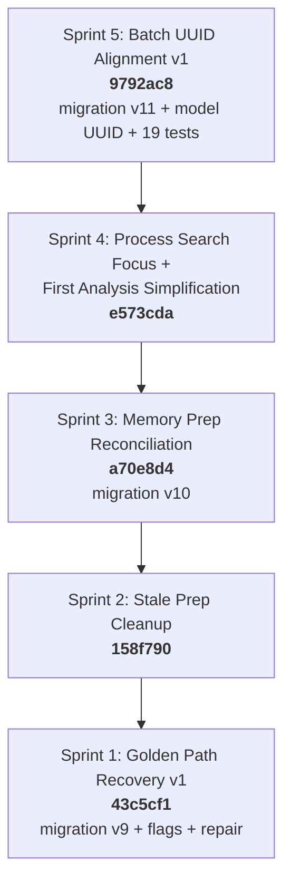
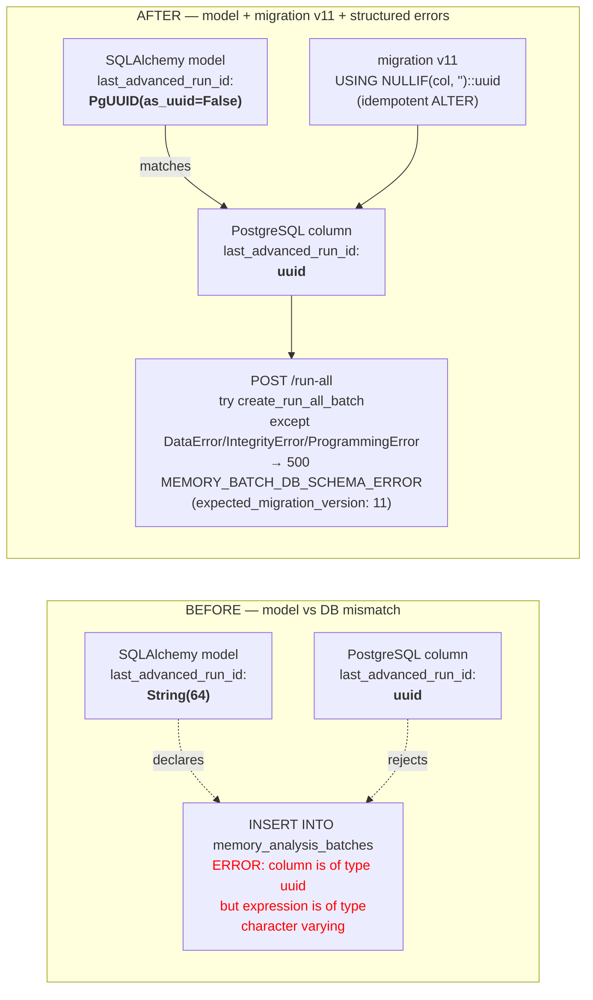
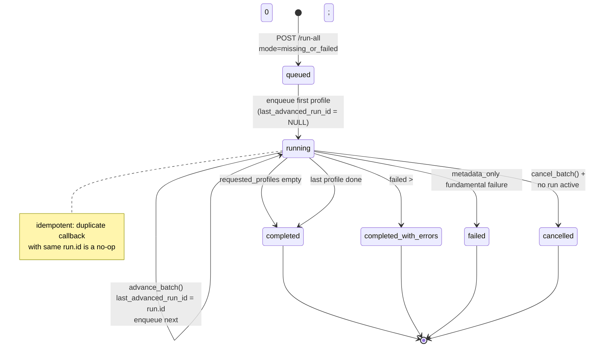
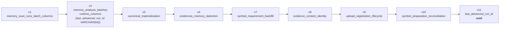
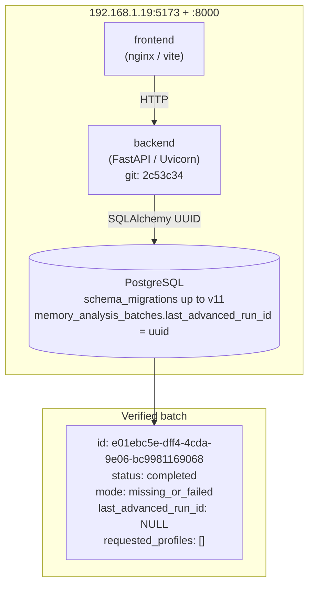

# Kairon DFIR — Memory Pipeline State (Sprint: Batch UUID Alignment v1)

## Sprint progression (most recent at top)

## Sprint 5 — Root cause and fix (Memory Batch UUID Alignment)

## Memory batch lifecycle

## Migration lineage (memory_* tables)

## Current state of remote stack

