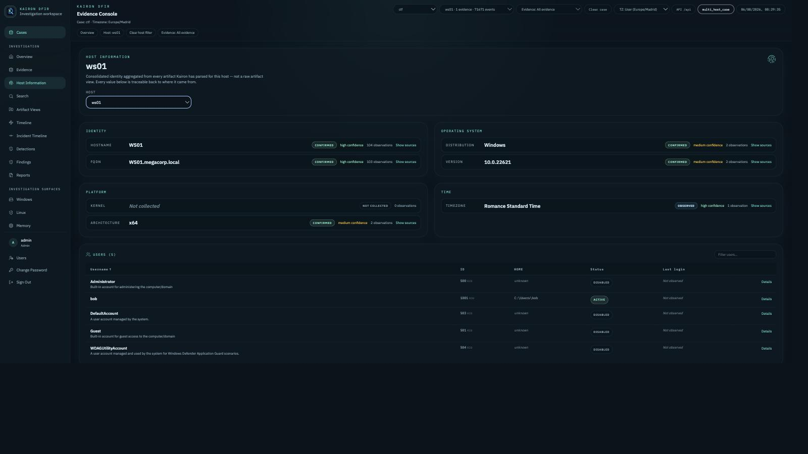

# Host Information

Host Information is Kairon's per-host layer for two related but distinct kinds of observation, both reached from the **Host Information** page for a given case host:

- **Host Facts** — identity and operating-system attributes of the host itself (hostname, distribution, kernel, timezone, ...).
- **Local Accounts** — the local-account inventory of that host (who has an account, and what Kairon can observe about it).

Both follow the same architecture and the same honesty rule: they never invent a value. A fact or account field Kairon has no observation for is reported as missing, not guessed, and every resolved value is shown alongside every observation that produced it (including disagreeing ones) rather than silently picking a winner.

```text
Evidence -> platform-specific producer -> normalized observation
    -> Host Facts / Host User Facts table -> resolved entity -> Host Information UI
```

A Host Fact or Host User Fact row never duplicates evidence: the raw file stays on disk under the evidence's own storage, and the full normalized record is already searchable under the source artifact's own family. This layer stores only the small set of fields one observation actually asserts, plus enough foreign keys (case, evidence, artifact, host) to stay connected to that chain.

Both layers are idempotent per evidence: reprocessing an evidence item deletes and rebuilds its own observations (matched by a content fingerprint) rather than accumulating duplicates alongside stale rows.



## Host Facts

Host Facts describe the host itself, not its accounts. Today, Host Facts producers are **Linux-only** — there is no Windows or memory-evidence producer yet. A host whose only evidence is Windows currently has no Host Facts observations at all; this is honest absence, not a bug, and is not yet documented anywhere else in this repository.

### Supported fact types and platform coverage

| `fact_type` | Linux | Windows | Memory |
| --- | --- | --- | --- |
| `host.hostname` | yes (`hostname`, `hostnamectl`) | not yet | not yet |
| `host.fqdn` | yes (`hostname`, `hostnamectl`) | not yet | not yet |
| `host.distribution` | yes (`os_release`, `lsb_release`, `hostnamectl`, `debian_version`) | not yet | not yet |
| `host.distribution_version` | yes (same sources) | not yet | not yet |
| `host.kernel` | yes (`uname`, `kernel_version`, `hostnamectl`) | not yet | not yet |
| `host.architecture` | yes (`uname`, `kernel_version`, `hostnamectl`) | not yet | not yet |
| `host.timezone` | yes (`etc_timezone`, `timedatectl`, `etc_localtime_symlink`, `sysconfig_clock`, `conf_d_clock`, `etc_localtime_tzif`, `hostnamectl`) | not yet | not yet |

Each source above is a `source_kind` — one Linux artifact family (`/etc/os-release`, `hostnamectl` output, `/etc/timezone`, ...) that independently asserts a value for that fact type.

### Conflict resolution

When more than one source observes the same `fact_type` for the same host, Kairon:

1. Stores every observation, never overwriting one source with another.
2. Reports a `status` per group: `observed` (one source), `confirmed` (multiple sources agree), `conflicting` (sources disagree), or `invalid` (the value couldn't be parsed).
3. Surfaces a deterministic `preferred_value` when sources disagree, using a fixed per-`(fact_type, source_kind)` priority ranking (for example, `/etc/os-release` outranks `hostnamectl` for distribution, since `hostnamectl` only carries a human-readable name). The ranking only picks which value is shown first — every conflicting observation is still returned alongside it, so a disagreement is visible, never hidden.
4. Never invents a value: a `fact_type` with zero observations for a host is reported as `status: "missing"`.

### Scope

Facts are scoped to a resolved host (`host_id`) once evidence is assigned to one, or to a single evidence item before host assignment. Kairon never guesses that two evidence items are the same host — scope is either explicit host assignment, or strictly the individual evidence item.

### API

```
GET /api/cases/{case_id}/host-facts?host_id=...&fact_type=...
GET /api/cases/{case_id}/host-facts?evidence_id=...&fact_type=...
```

Exactly one of `host_id` or `evidence_id` is required. `fact_type` is optional; omitting it returns every fact type observed in scope.

## Local Accounts

Local Accounts is the local-account inventory: one resolved entry per username (or, for a Windows account with no Linux/POSIX analogue field, per the concept that column represents — see below). Unlike Host Facts, this layer is already cross-platform.

### Sources

| `source_kind` | Platform | What it asserts |
| --- | --- | --- |
| `passwd` | Linux | UID, primary GID, home, shell, GECOS/full name |
| `shadow` | Linux | password status classification only (`locked` / `set` / `empty`) — never the hash itself |
| `group_definition` | Linux | a group's own GID/name |
| `group_membership` | Linux | one user's membership in a secondary group |
| `sudoers_rule` | Linux | a `sudoers` rule naming a user or `%group` |
| `lastlog` | Linux | last login timestamp, source IP, terminal |
| `sam_account` | Windows | one account from the SAM hive: RID, account-control flags, full name/comment, last logon, last password set, bad-password count, logon count |
| `profile_list` | Windows | one `ProfileList` entry from the SOFTWARE hive: SID and cached profile path — **corroborating evidence only**, see below |

### Cross-platform field reuse

Windows accounts reuse the same typed columns Linux already established, where the underlying concept genuinely matches — an `id_kind` field records which concept actually produced the value, so the UI labels it correctly without platform branching:

| Column | Linux meaning | Windows meaning |
| --- | --- | --- |
| `uid` | POSIX UID | SAM RID (`id_kind: "rid"`) |
| `home` | `/etc/passwd` home directory | `ProfileList` cached profile path |
| `gecos` | `/etc/passwd` GECOS field | SAM full name / comment |
| `password_status` | shadow classification | not applicable (Windows accounts never populate this field) |
| `shell` | login shell | not applicable |

Fields with no Linux analogue (RID, SID, raw account-control flags, logon count, bad-password count, last-password-set timestamp) live in a producer-specific `attributes` bundle instead of widening the shared schema.

### Windows SAM: what is and isn't read

The SAM hive is the actual account database Windows reads at logon — the highest-confidence source available for "which local accounts exist on this machine." Kairon decodes, from the unencrypted, SysKey-independent parts of the hive only:

- the account list and each account's RID;
- account-control flags, classified into a single primary `account_status` of `active`, `disabled`, or `locked` (every raised flag bit is still preserved in full under `attributes.account_flags`, so a coexisting condition is never lost — only collapsed into one primary state, the same way Windows itself treats a locked-out account as unusable regardless of its disabled bit);
- last logon, last password set, bad-password count, logon count;
- username, full name, comment;
- the machine's own SID (from `SAM\Domains\Account\V`), used to validate `ProfileList` cross-references below.

**Password hashes are never read, decoded, or stored.** This is a hard boundary in the parser itself, not a redaction step applied afterward.

**Not yet implemented**: local group membership (`SAM\Domains\Builtin\Aliases` — e.g. who is in the local `Administrators` group). This is real, decodable data that Kairon does not yet decode; it is a documented gap, not an inferred absence. Group membership shown for a Windows account today is empty, and effective-sudo-equivalent (`effective_sudo` in the resolved entry) is always empty for Windows accounts this release — never inferred from account flags or RID.

### Windows ProfileList: corroborating evidence only

`ProfileList` records one entry per profile Windows has ever loaded, keyed by SID — but a SID there is not proof of a local account. A domain account that logged on interactively gets a cached profile too, under an SID whose authority belongs to the domain, not this machine.

For this reason, a `profile_list` observation **never creates a Local Accounts entry by itself**. It only attaches (contributing the `home`/profile-path field) to an account a `sam_account` observation already created, and only when the `ProfileList` SID's RID *and* authority both match that SAM account's own machine SID. A `ProfileList` SID that doesn't match is never surfaced in Local Accounts — it remains fully searchable via the raw artifact index, just not folded into the account inventory.

### Resolution and conflict handling

Local Accounts resolves observations into one entry per username the same way Host Facts resolves per-host-per-fact_type: every field (typed column or `attributes` key) is resolved independently, disagreement is always surfaced alongside a deterministic preferred value, and a field with zero observations is reported as missing rather than guessed.

`passwd` (Linux) and `sam_account` (Windows) are the only two source kinds merged into one "identity" resolution — both are direct, authoritative account-store records answering the same question ("what does this account's own store say about it"). No cross-source reliability ranking exists for these fields the way Host Facts ranks `os-release` over `hostnamectl`: the account store is definitionally authoritative, so multiple disagreeing observations are themselves the noteworthy signal (for example, a duplicated or changed UID/RID between snapshots), and the most recently observed value is preferred, deterministically, while every value stays visible.

### Provenance and idempotency

- Never stores password hashes or raw shadow/SAM secret material — `password_status` and `account_status` are classifications computed once at parse time from each producer's own reliable signal, never inferred later from an unrelated field.
- A duplicate-account line within one artifact (for example, two `passwd` rows for the same username — a known persistence technique) is preserved as two separate observations, not silently collapsed.
- Reprocessing an evidence item rebuilds its Local Accounts observations from scratch rather than accumulating stale rows next to fresh ones.

### API

```
GET /api/cases/{case_id}/host-users?host_id=...
GET /api/cases/{case_id}/host-users?evidence_id=...
```

Exactly one of `host_id` or `evidence_id` is required, with the same scope contract as `/host-facts` — results are never merged across hosts.

## Known gaps

- No Windows or memory-evidence Host Facts producer exists yet — hostname, timezone, distribution/OS-version, kernel and architecture are Linux-only today, even though the underlying framework is already platform-agnostic.
- Windows local *group* membership (e.g. local `Administrators`) is not decoded from the SAM hive yet.
- Local Accounts and Host Facts are both about the **current, static** state an artifact captures. Neither layer tracks login *sessions* or an "observed identity used this session" concept — that is a possible future extension, not present today.
