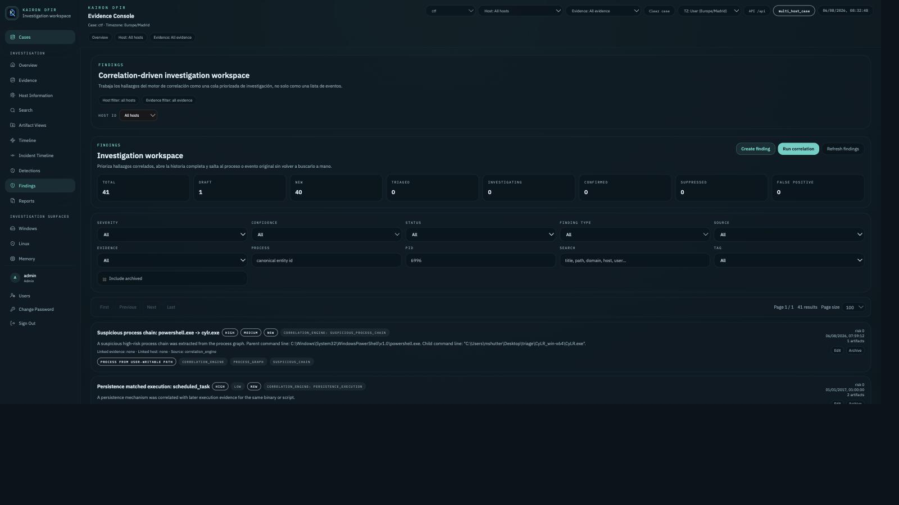

# Findings / Notes v1

Findings are analyst-owned notes and conclusions attached to a case. They let investigators document what is relevant, suspicious, pending review, confirmed, or ready to include in a later report without leaving Kairon.

## Notes vs Confirmed Findings

- Use `draft` for working notes, hypotheses, or follow-up reminders.
- Use `review` when a finding needs another analyst pass.
- Use `confirmed` for conclusions that should be considered reportable.
- Use `false_positive` when the lead was reviewed and dismissed.
- Use `archived` to hide old findings without deleting investigative history.

## Severity

Severity can be `info`, `low`, `medium`, `high`, or `critical`.

Use `info` for neutral notes, `medium` for suspicious activity that needs validation, and `critical` only for high-confidence impact or compromise indicators.

## Status

The v1 workflow is intentionally simple: `draft`, `review`, `confirmed`, `false_positive`, and `archived`.

Legacy correlation statuses may still appear for automatically generated findings.

## Tags

Tags group findings by investigation theme, for example `memory`, `ctf`, `persistence`, or `ransomware`.

Tags are normalized to lowercase, trimmed, deduplicated, and safe for filtering.

## Linking

Findings can link to a case, evidence, case host, artifact id, artifact family/type, source event id, and a source view such as `memory`, `evidence`, `artifact_explorer`, or `search`.

Contextual Create finding actions prefill these fields when launched from Evidence Detail, Search, Artifact Explorer, or Memory.

## Creating Findings From Artifacts And Events

Use `Create finding from this` when you are reviewing a concrete suspicious row or event. Kairon opens an editable finding modal with title, body, severity, status, tags, evidence, host, artifact/event metadata, source view, timestamp, and source summary already filled in.

Supported entry points:

- Search result rows and search detail actions.
- Artifact Explorer focused rows, including browser/downloads, PowerShell, Windows Events, Registry, Services, Scheduled Tasks, Defender, Network, Prefetch, Autoruns, and generic artifact rows.
- Memory process rows and memory-derived artifact views where row context is available.
- Evidence Detail keeps `Create finding for this evidence`, which links the whole evidence item rather than a specific event or artifact row.

Finding linked to evidence means the note applies to the whole uploaded collection or memory image. Finding linked to an artifact/event means it preserves the exact row or event that triggered the analyst decision.

## Source Snapshot

Findings created from a row save a limited `source_snapshot_json` object with safe investigation context such as timestamp, artifact family/type, host, evidence label, summary, URL/path/command/process/user fields, and event id when available.

Kairon does not save binary blobs, full dumps, full files, oversized payloads, obvious secrets/tokens/password fields, or internal server paths in the snapshot. The backend enforces a size limit, and the UI renders the snapshot as escaped JSON.

## Open Source

Findings created from concrete rows show a `Source artifact/event` section with `Open source`.

When `source_route` is available, Kairon returns to the original or nearest captured route. If exact reconstruction is not available, Kairon opens the closest view using linked evidence, host, artifact type, source view, or source event id.

## Suggested Workflow

1. Create a draft finding when something looks relevant.
2. Link it to the evidence or host that supports it.
3. Add tags for the investigation theme.
4. Raise severity as confidence increases.
5. Move to `review` or `confirmed` after validation.
6. Archive stale or superseded findings instead of deleting them permanently.

## Limitations

Findings / Notes v1 is not a final report generator. It does not implement a complete PDF report workflow or advanced incident timeline generation. Source reopening is best-effort when the original source row is no longer present; the preserved snapshot remains available in the finding.
