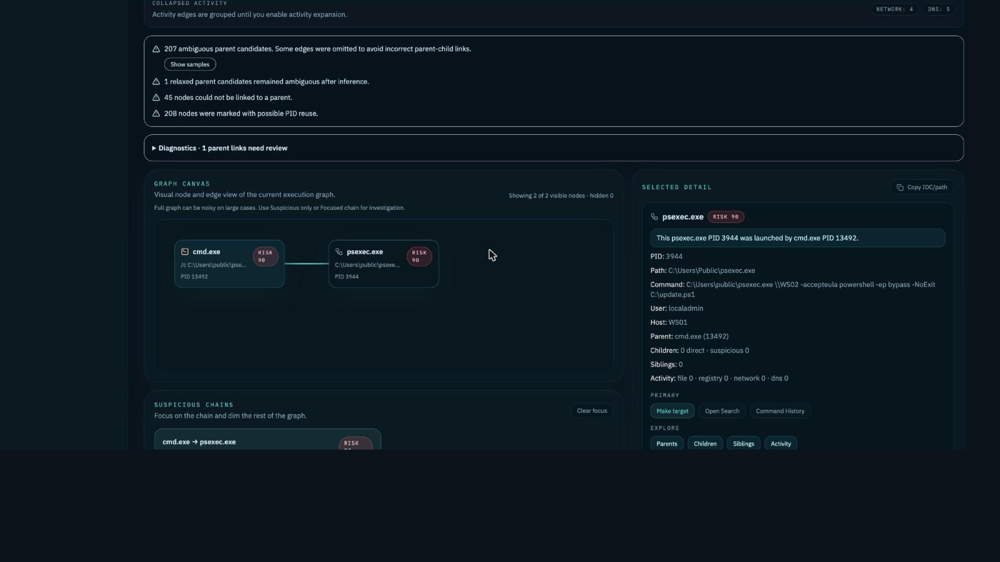

# Execution Story / Process Graph

The main process-investigation experience is `Execution Story`. The advanced graph remains available for broader graph/debug work.

## Execution Story answers

- Who launched this process?
- What did it launch?
- What did it do?
- Why is it suspicious?
- What evidence supports it?

## Identity model

Exact pivots use stable identity in this order:

1. `source_event_id`
2. process GUID / entity ID
3. PID + timestamp + host + evidence
4. text query only as last fallback

Opening a story from Search or Command History should target the exact selected event/process, not a similar command line.

## UI behavior

- Header, canvas, fallback tree and selected detail share one story target.
- Clicking a node previews it only.
- `Make target` intentionally rebuilds the story for that node.
- Suspicious chains are secondary and must not steal focus from an exact story.
- Diagnostics stay collapsed unless needed.

## What it shows

- investigation target
- parent sentence
- children sentence
- activity summary
- visual tree
- source events
- commands
- risk reasons
- parent/child diagnostics when expanded

## Noise controls

Activity edges are grouped/collapsed by default:

- file activity
- registry activity
- network activity
- DNS activity

The advanced graph exposes controls for node caps, activity caps, edge types and diagnostics.

## Where activity comes from

Activity is attached to a process by its GUID (or PID, host and time):

- network: Sysmon 3
- DNS: Sysmon 22
- files: Sysmon 11, 15, 23, 26
- registry: Sysmon 12, 13, 14, and Security 4657 when object-access auditing is on
- image loads, process access and remote threads: Sysmon 7, 10, 8

A process needs its start event (Sysmon 1 or Security 4688) in the evidence to have a node; activity of processes that were already running when logging began (for example services started at boot) is searchable but has nothing to attach to. Before 2026-10-05 registry activity never attached to processes; no reprocessing is needed, the graph reads the existing events.

## Limitations

- Parent links depend on available Sysmon/Security/process fields.
- PID-only pivots can be ambiguous without timestamp/host/evidence.
- Graph edges are investigative context, not proof by themselves.
- Advanced full graph can be noisy; prefer Execution Story for analyst workflow.

