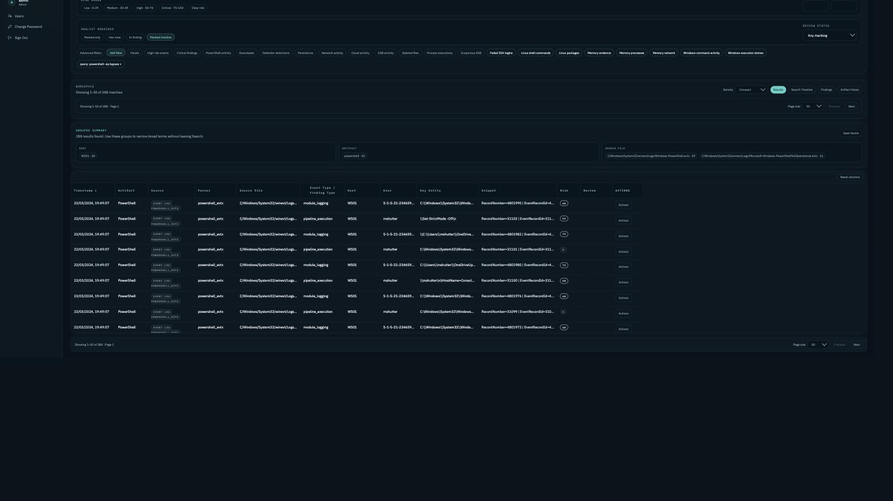

# Search

`Search` is the main investigation workspace. `Search Timeline` is a Search view for exploring results filtered by time; `Incident Timeline` is the curated/reportable story of the case. `Artifact Views` are specialized views by artifact family.

## What it supports

- free text and IOC-aware search.
- command flags and Windows paths as phrases.
- filters by case, evidence, host, time, artifact type, parser, backend variant, markings and risk.
- include/exclude filters.
- facets and quick filters.
- event detail with pivots.
- links to Command History, Execution Story, Search Timeline, Findings and Reports.

## Command and path queries

Search treats command flags as literal text. These examples should search for text/technical fields, not negative operators:

- `powershell -ep bypass`
- `"powershell -ep bypass"`
- `-ep`
- `-nop`
- `-w hidden`
- `NoExit`
- `script.ps1`
- `C:\Users\Public\script.ps1`
- `/c C:\Users\Public\remote-admin.exe`
- `C:\Users\Public\remote-admin.exe`
- `example-control.test`

To exclude results, use:

- `does not contain` filters
- `exclude_q`
- negative artifact/host/parser/source filters
- `NOT` syntax documented in advanced mode

Do not use `-term` expecting implicit exclusion.

## Fields searched by `q`

Search prioritizes:

- `process.command_line`
- parent process command line
- command / normalized command
- `key_entity`
- `file.path`
- `object.name`
- `defender.path`
- `threat.name`

It also searches in:

- event message / summary
- registry path
- DNS / URL / domain fields
- source file
- MFT path/name
- RecentDocs / OpenSaveMRU paths
- Defender threat/action/path
- Command History command/launcher/family
- LNK/Jumplist targets
- Amcache/Shimcache paths

## Path matching

Windows paths are matched through:

- raw full path
- slash/backslash variants
- lowercase variants
- basename expansion
- selected wildcard fields

Example: `C:\Users\Public\remote-admin.exe` can match a full path or `remote-admin.exe`.

## Host filtering

Host filters are alias-aware. Filtering by `HOST-A` can match documents observed as:

- `HOST-A`
- `host-a`
- `host-a.example.local`

The original observed host remains visible in details.

## Search Timeline as Search view

Search Timeline preserves Search context:

- case
- evidence
- host
- query
- time range
- artifact filters

MFT/filesystem documents are excluded by default from Search Timeline because full MFT can add hundreds of thousands of timestamped rows. Include them with:

- `artifact_type=mft`
- `include_filesystem_timeline=true`
- opening timeline from the MFT Artifact View

## Artifact Views vs Search

Use Search for global investigation and pivots.

Use Artifact Views when you need specialized columns:

- MFT path/deleted/timestamps
- Defender threat/action/path
- User Activity MRU/program/path fields
- Prefetch run counts
- LNK/Jumplist targets
- Amcache/Shimcache inventory fields

Artifact Views should always offer a way back to Search for matching documents.

## Advanced backend filters

EZ Tool advanced rebuilds can produce additional docs for LNK, Jumplist, Amcache and Shimcache.

Default Search hides advanced variants to avoid duplicate-looking results. Use:

- `backend_variant=advanced`
- `backend_variant=all`
- `parser_backend=<backend>`

when comparing or explicitly investigating advanced parser output.

## Supported field syntax

Search supports a safe allowlisted subset:

- `artifact.type:mft`
- `process.name:powershell.exe`
- `file.name:"invoice.docm"`
- `risk_score>=70`
- `has:file.path`
- `NOT artifact.type:mft`

It is not full KQL or full Lucene. Invalid syntax should return a clear error.
