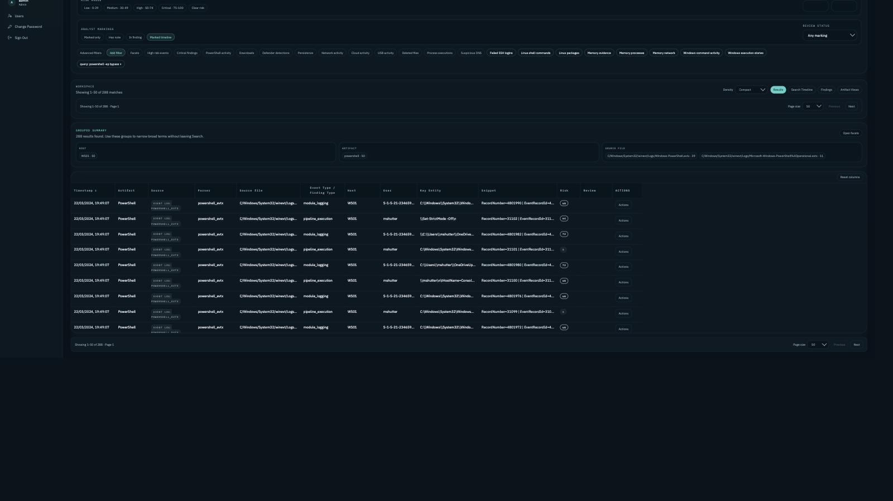

# Search

`Search` is the main investigation workspace. `Search Timeline` is a Search view for exploring results filtered by time; `Incident Timeline` is the curated/reportable story of the case. `Artifact Views` are specialized views by artifact family.

## What it supports

- free text and IOC-aware search.
- command flags and Windows paths as phrases.
- filters by case, evidence, host, time, artifact type, parser, backend variant, markings and risk.
- include/exclude filters.
- facets and quick filters.
- event detail with pivots.
- links to Command History, Execution Story, Search Timeline, Findings and Reports.

## Command and path queries

Search treats command flags as literal text. These examples should search for text/technical fields, not negative operators:

- `powershell -ep bypass`
- `"powershell -ep bypass"`
- `-ep`
- `-nop`
- `-w hidden`
- `NoExit`
- `script.ps1`
- `C:\Users\Public\script.ps1`
- `/c C:\Users\Public\remote-admin.exe`
- `C:\Users\Public\remote-admin.exe`
- `example-control.test`

To exclude results, use:

- `does not contain` filters
- `exclude_q`
- negative artifact/host/parser/source filters
- `NOT` syntax documented in advanced mode

Do not use `-term` expecting implicit exclusion.

## Fields searched by `q`

Search prioritizes:

- `process.command_line`
- parent process command line
- command / normalized command
- `key_entity`
- `file.path`
- `object.name`
- `defender.path`
- `threat.name`

It also searches in:

- event message / summary
- registry path
- DNS / URL / domain fields
- source file
- MFT path/name
- RecentDocs / OpenSaveMRU paths
- Defender threat/action/path
- Command History command/launcher/family
- LNK/Jumplist targets
- Amcache/Shimcache paths

## Path matching

Windows paths are matched through:

- raw full path
- slash/backslash variants
- lowercase variants
- basename expansion
- selected wildcard fields

Example: `C:\Users\Public\remote-admin.exe` can match a full path or `remote-admin.exe`.

## Host filtering

Host filters are alias-aware. Filtering by `HOST-A` can match documents observed as:

- `HOST-A`
- `host-a`
- `host-a.example.local`

The original observed host remains visible in details.

## Search Timeline as Search view

Search Timeline preserves Search context:

- case
- evidence
- host
- query
- time range
- artifact filters

MFT/filesystem documents are excluded by default from Search Timeline because full MFT can add hundreds of thousands of timestamped rows. Include them with:

- `artifact_type=mft`
- `include_filesystem_timeline=true`
- opening timeline from the MFT Artifact View

## Artifact Views vs Search

Use Search for global investigation and pivots.

Use Artifact Views when you need specialized columns:

- MFT path/deleted/timestamps
- Defender threat/action/path
- User Activity MRU/program/path fields
- Prefetch run counts
- LNK/Jumplist targets
- Amcache/Shimcache inventory fields

Artifact Views should always offer a way back to Search for matching documents.

## Advanced backend filters

EZ Tool advanced rebuilds can produce additional docs for LNK, Jumplist, Amcache and Shimcache.

Default Search hides advanced variants to avoid duplicate-looking results. Use:

- `backend_variant=advanced`
- `backend_variant=all`
- `parser_backend=<backend>`

when comparing or explicitly investigating advanced parser output.

## Field syntax

Search accepts an allowlisted subset of a query language. It is not full KQL or Lucene; anything it does not understand returns a clear error with examples instead of a wrong result.

| Syntax | Example |
| --- | --- |
| field and value | `process.name:powershell.exe`, `file.name:"invoice.docm"` |
| several terms (AND is implicit) | `eventid:4624 logontype:10` |
| `OR` and parentheses | `(eventid:4624 OR eventid:4625) user:admin` |
| `NOT` | `NOT artifact.type:mft` |
| numeric comparison | `risk_score>=70` |
| field present | `has:file.path` |
| wildcard | `provider:*Sysmon*`, `package:openssh*` |

A leading wildcard (`*value`) is accepted only on fields where it is useful (paths, command lines, channels, providers, service and task names, file names); elsewhere use a prefix (`value*`). There are limits on the number of `OR` and wildcard clauses so one query cannot overload the index.

### Shortcuts

Short names that expand to the full field(s):

| Shortcut | Searches | Example |
| --- | --- | --- |
| `host:` `user:` | host name, user name (Windows and Linux) | `user:root` |
| `process:` `command:` `exe:` | process name, command line, executable path | `process:sshd` |
| `file:` `path:` `hash:` | file path/name, any path, SHA-256/SHA-1/MD5 | `hash:<sha256>` |
| `ip:` `port:` `proto:` | source/destination address, port, protocol | `ip:203.0.113.9` |
| `domain:` `url:` | DNS, URL and e-mail domains; full URL | `url:*example.test*` |
| `type:` `artifact:` `parser:` `source:` | event type, artifact type, parser, detection source | `type:logon_failed` |
| `risk:` `severity:` `status:` | risk score, severity, status | `risk>=70` |
| `rule:` | rule name, title or id | `rule:mimikatz` |

Windows event logs:

| Shortcut | Field | Example |
| --- | --- | --- |
| `eventid:` | event ID | `eventid:4688` |
| `channel:` | log channel | `channel:Security` |
| `provider:` | event provider | `provider:*Sysmon*` |
| `logontype:` | logon type (2 interactive, 3 network, 10 remote desktop…) | `logontype:10` |
| `service:` | service name (7045, 4697) | `service:*remote*` |
| `task:` | scheduled task name (4698-4702) | `task:*Update*` |

Event IDs are reused by different logs (4104 is PowerShell, but also other providers): add `channel:` or `provider:` when an ID is ambiguous.

Linux:

| Shortcut | Field | Example |
| --- | --- | --- |
| `action:` | event action (login, sudo, ban…) | `jail:sshd action:fail2ban_ban` |
| `runas:` | target user of sudo/su | `runas:root` |
| `package:` `pkgaction:` | package name, install/remove/upgrade | `package:openssh* pkgaction:install` |
| `indicator:` | suspicious-pattern flags on commands, web requests and containers (`reverse_shell`, `embedded_base64`, `ip_port_reference`, `privileged_container`, `secret_access`…) | `indicator:reverse_shell` |
| `timequality:` | how the timestamp was resolved (see [Linux support](../linux/linux-support.md)) | `timequality:inferred_year` |
| `verdict:` `jail:` | firewall verdict, fail2ban jail | `verdict:block` |
| `webserver:` `xff:` | web server, X-Forwarded-For | `webserver:nginx` |
| `library:` `pam:` | preloaded library, PAM module | `pam:pam_exec.so` |
| `audit:` `auditkey:` `sysmon:` | auditd type and key, Sysmon for Linux event ID | `auditkey:passwd_changes` |
| `dbengine:` `database:` `dbcommand:` `sql:` `dbstatus:` `dberror:` | database logs | `sql:*DROP*` |
| `vpn:` `vpnstatus:` `vpnip:` `vpnconn:` | VPN logs | `vpn:openvpn` |
| `sender:` `recipient:` `queue:` `mailstatus:` `mailservice:` `relay:` | mail logs | `mailstatus:bounced` |
| `container:` `image:` `pod:` `stream:` | container logs | `container:web` |
| `verb:` `resource:` `subresource:` `namespace:` `k8sobject:` `decision:` | Kubernetes audit | `verb:create resource:secrets` |
| `logformat:` | text log format detected | `logformat:syslog` |

Any `linux.*` field can also be searched by its full name.

The **Investigation Guide** page in the app (sidebar, under Docs) has ready-made searches per question (persistence, logons, lateral movement, sudo…) that run on the active case.

## Result window

Search pages through the first 10,000 results of a query, which is the index's result window. The total is still counted exactly; when a page would go past 10,000 the pager says so instead of failing. Narrow the query (time range, host, artifact) to reach the rest, or sort the other way to see the oldest results first.
